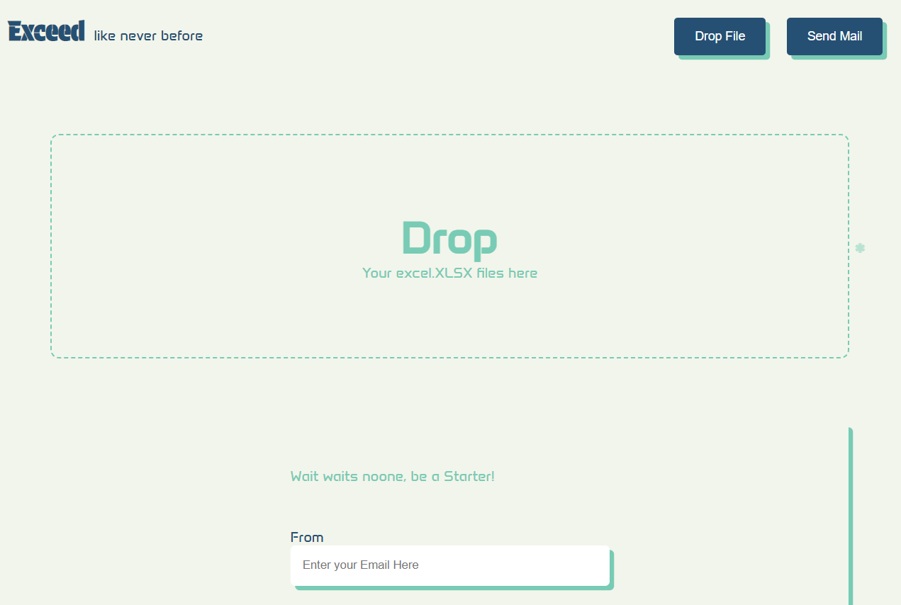

# Exceed  

*Exceed is an interactive web app, where you can send an email to multiple people listed on your spreadsheet file, Just drag and drop. To,From,Subject,Mail -> all yours, just enter.*

 

## Get Started

`Install this Github repo:` [click here](https://github.com/shree5-png/exceed_xlsx_to_email.git) 

>**Setup**

`npm install` 
`npm start` 

>**Run**

*on your favourite browser* 
`localhost:5000` 

*There you go!, You are ready to swing*

## Notes

>*Make sure the title of spreadsheet column that contains emails should be `emails` or `Email`*  

**App Password** : *app pass is not the regular password of your email, but you can find it in the security section of your email manage section, [here is the guide to find it](https://youtu.be/lSURGX0JHbA?si=KWbn7gl8J3L_IxSI)*

